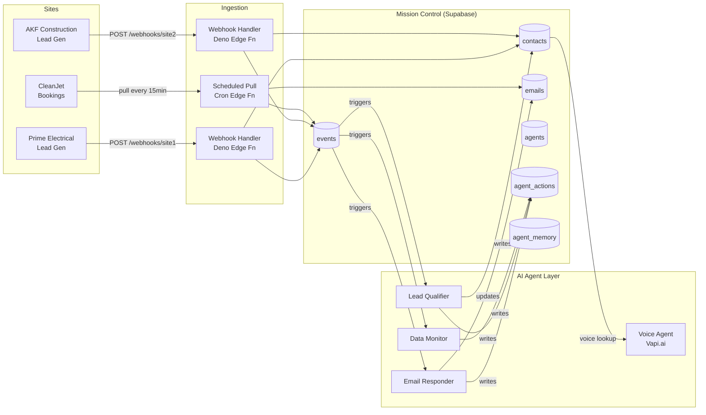

# Mission Control — System Architecture

> **Status:** Initialized — sites registered, schema gap identified, 1 of 4 agents partially live
> **Last Updated:** 2026-02-22
> **Owner:** Engineering Lead

---

## Current State

| Component | Status |
|-----------|--------|
| Supabase project | `tfdxlhkaziskkwwohtwd.supabase.co` ✅ Live |
| Golden Record schema | `customers`, `leads`, `cross_sell_events` ✅ Applied |
| Voice agent schema | `knowledge_base`, `vapi_call_log`, `vapi_caller_sessions` ✅ Applied |
| Mission Control schema | `sites`, `contacts`, `events`, `emails`, `agents`, `agent_actions`, `agent_memory` ✅ Applied (migration `20260222043702`) |
| `vapi-webhook` Edge Function | ✅ Deployed — Prime Electrical live |
| `ingest-prime` Edge Function | ✅ Live — fully connected |
| `ingest-akf` Edge Function | ✅ Live — fully connected |
| `ingest-cleanjet` Edge Function | ✅ Live — fully connected |
| Voice intake agent (Max / Prime) | ✅ Live — +6498734191 |
| Voice intake agent (Alex / AKF) | ⚠️ Vapi assistant deployed, no phone number |
| Voice intake agent (Jess / CleanJet) | ⚠️ Vapi assistant deployed, no phone number |
| Email responder agent | ❌ Pending — email provider not configured |
| Lead qualifier agent | ✅ Live — `lead-qualifier` Edge Fn, fires on every `form_submit` |
| Data monitor agent | ✅ Live — `data-monitor` Edge Fn, schedule `*/15 * * * *` (set in dashboard) |

---

## Hub Definition

- **Purpose:** Mission Control is the central intelligence hub that aggregates all data, contacts, emails, and events from 3 business websites into a single authoritative source of truth, and serves as the operational home for all AI agents.
- **Service boundary:** Mission Control OWNS — contacts, unified events, emails, agent actions, agent memory. Sites OWN — their own UI, local sessions, site-specific raw data before ingestion.
- **Data flow direction:** Sites → Mission Control (inbound). Mission Control → Sites (triggered notifications/updates only).

---

## Site Registry

| # | Site Name | URL | Purpose | Primary Data Types | Connection Method | Trigger |
|---|-----------|-----|---------|-------------------|------------------|---------|
| 1 | Prime Electrical | https://prime-electrical-nu.vercel.app | Electrical services, lead generation | leads, form submissions, voice calls | Webhook push (n8n pipeline) | On form submit / call received |
| 2 | AKF Construction | https://akf-construction.vercel.app | Construction & renovation, lead generation | leads, form submissions | Webhook push (to configure) | On form submit |
| 3 | CleanJet | https://cleanjet-phi.vercel.app | Cleaning services, online booking | bookings, leads, form submissions | Webhook push (to configure) | On form submit / booking placed |

---

## Data Flow Diagram

---

## Integration Points

| Integration | Provider | Method | Status |
|-------------|---------|--------|--------|
| Email inbound | Resend / Postmark | Webhook → `emails` table | [ ] To configure |
| Email outbound | Resend / Postmark | Edge Function → provider API | [ ] To configure |
| Voice (Vapi) | Vapi.ai | Webhook → `vapi-webhook` Edge Fn | [✅] Prime live (+6498734191) — AKF/CleanJet pending phone numbers |
| SMS / notifications | [TBD] | [TBD] | [ ] To decide |

---

## Webhook Endpoints (to configure on each site)

| Endpoint | Handles | Auth | Status |
|----------|---------|------|--------|
| `https://tfdxlhkaziskkwwohtwd.supabase.co/functions/v1/ingest-prime` | Prime Electrical form submissions | `x-webhook-secret: PRIME_WEBHOOK_SECRET` | ✅ Live |
| `https://tfdxlhkaziskkwwohtwd.supabase.co/functions/v1/ingest-akf` | AKF Construction form submissions | `x-webhook-secret: AKF_WEBHOOK_SECRET` | ✅ Live |
| `https://tfdxlhkaziskkwwohtwd.supabase.co/functions/v1/ingest-cleanjet` | CleanJet form submissions / bookings | `x-webhook-secret: CLEANJET_WEBHOOK_SECRET` | ✅ Live |
| `https://tfdxlhkaziskkwwohtwd.supabase.co/functions/v1/ingest-email` | Inbound emails | Provider signature | ❌ Not yet created |
| `https://tfdxlhkaziskkwwohtwd.supabase.co/functions/v1/vapi-webhook` | Voice agent events | Vapi HMAC | ✅ Live |

---

## Suggested Additions

- [ ] **Contact deduplication service** — merge contacts when same email arrives from multiple sites
- [ ] **Site health monitor** — alert if a site stops sending data for >2 hours
- [ ] **Event replay capability** — ability to reprocess events if an agent failed
- [ ] **Unified dashboard** — read-only view of all contacts, events, and agent actions
- [ ] **Agent confidence scoring** — track how often each agent escalates vs. self-resolves

---

## Update Protocol

When connecting a new site:
1. Add a row to the `sites` table in Supabase
2. Add a row to this Site Registry table
3. Scaffold a new ingestion Edge Function
4. Configure the webhook on the site pointing to the new endpoint
5. Run `/mission-control connect [site name]` to execute the connection workflow
